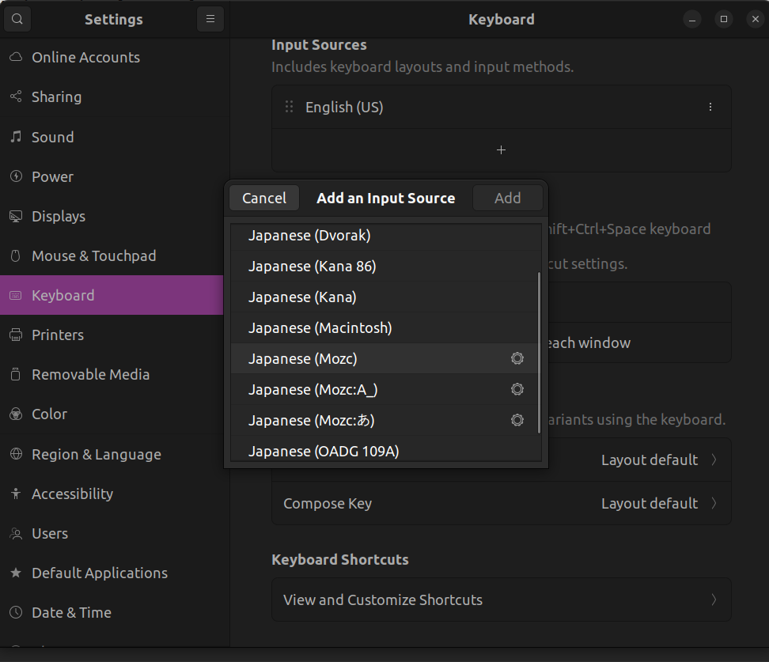
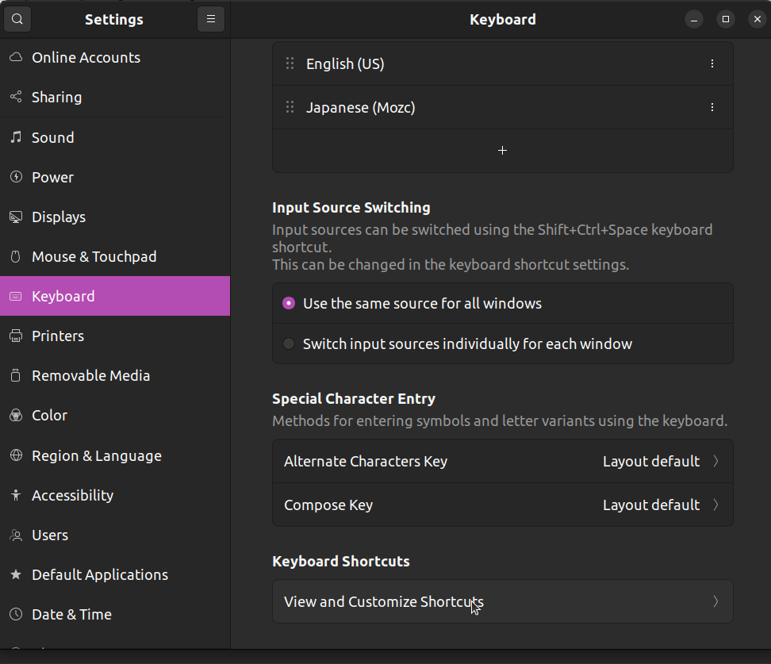
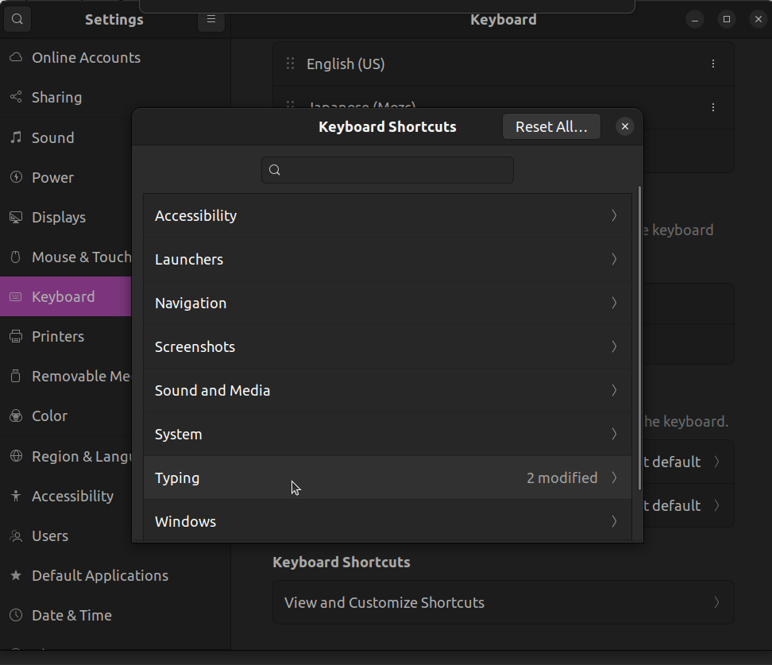
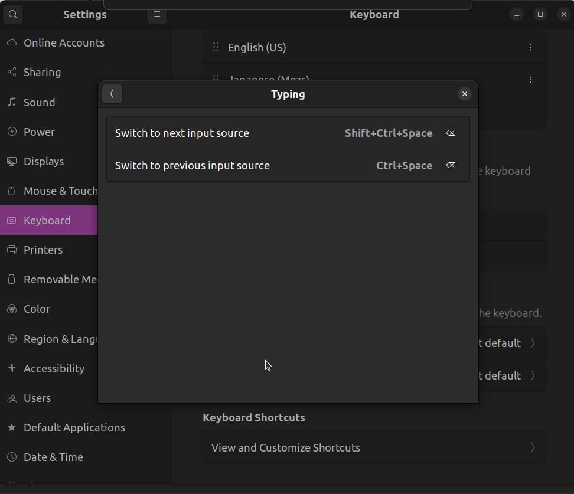

# dotfiles

個人用の `dotfiles` のレポジトリ.

## セットアップ

```bash
curl -LsSf https://astral.sh/uv/install.sh | sh
uv python install
uv sync
uv run ansible-playbook ansible/playbook.yaml --ask-become-pass
```

## 日本語入力

### mozc

mozcで入力を切り替えた際に始めから日本語入力になっていて欲しい（デフォルトでは直接入力）．[このオプションは入ったが](https://github.com/google/mozc/issues/381)，Ubuntu22.04で入るmozcではまだ利用できない．そのため[こちら](https://zenn.dev/ikuya/articles/aa69fd1009b773)に従って上書き更新する．

Dockerfileとしては代わりに

```bash
curl -O https://raw.githubusercontent.com/google/mozc/b0a604f110e01d11107ebbaad09e674cecee34f5/docker/ubuntu22.04/Dockerfile


- RUN apt-get install -y bazel
+ RUN apt-get install -y bazel-7.7.1
+ RUN ln -s /usr/bin/bazel-7.7.1 /usr/bin/bazel
```

を用いること．

その後`~/.config/mozc/ibus_config.textproto`の`mozc-jp`のフィールドを以下のように更新する．

```
engines {
  name : "mozc-jp"
  longname : "Mozc"
  layout : "default"
  layout_variant : ""
  layout_option : ""
  symbol : "あ"
  composition_mode: HIRAGANA # これが一番重要
}
```

その後`ibus write-cache`してから再起動すると始めから日本語入力ができるようになる．

### Ctrl-Spaceで日英の切り替え

英語の次にJapaneseで"Japanese (Mozc)"を選択する．



"Ctrl-Space"でInput Sourceを切り替えるように変更する．

| View And Customize Shortcuts           | Typing                                 | Switch                                 |
|----------------------------------------|----------------------------------------|----------------------------------------|
|  |  |  |

## gnome-terminal

gnome-terminal上での入力だけ遅れる現象が起きる場合は https://askubuntu.com/questions/1509058/input-delay-on-terminal-ubuntu-22-04-4 に従ってmutterを更新する．

## tmux

tmuxのキーバインドは以下の通り.

- `C-z c`で**ホームディレクトリで**新しいwindowをつくる
- `C-z C-c`で **現在のディレクトリで**新しいwindowをつくる
- `C-z k`で現在のwindowを消去
- `C-z n(p)`でnext(right), previous(left)のwindowへ移動
- `C-z {0-9}`で番号のwindowに移動
- `C-z |`で**現在のディレクトリで**縦にpaneを作る
- `C-z -`で**現在のディレクトリで**横にpaneを作る
- `C-z o`, `C-z C-o`で隣のpaneに移る
- `C-z M`でsessionを名前付きで保存
- `C-z N`でsessionを名前付きで復帰(補完はできなさそう)

コピーアンドペーストは以下の手順.

1. `C-z [`で画面上をカーソルで移動するモードに入る.
2. `C-z @`で現在のカーソル位置からカーソルを動かしたところまでを選択するモードに入る.
3. `C-z {p, n, f, b}`(Emacsと同じ)で範囲を選択.
4. `Alt-w`でコピーできる.
5. `C-z C-y`でペースト.

これをシステムのクリップボードに移すために`pbcopy`コマンドを作った．マウスで範囲を選択した場合も`pbcopy`コマンドが必要．

## languages

### Julia

`~/.local/opt/`に`julia-x.x.x`のディレクトリをインストールし，`~/.local/bin/julia`へのsymlinkを張る．

### Rust

`~/.local/bin/`にツールチェーンをインストール．

### ROS2

colconに付属する`argcomplete`はバージョンが古いため`fish`に対応していない．

```
pip3 install --user argcomplete==2.0.0
```

すれば，aptで入ったargcompleteとconflictせずに済む．

fishについては[こちらの記事を参照](https://zenn.dev/kenji_miyake/articles/c149cc1f17e168)．

```bash
sudo apt-get install fzf fd-find jq
ln -s $(which fdfind) ~/.local/bin/fd
```

勝手にsourceするのを防ぐには

```bash
auto_source_disable
```

すれば良い．

## Emacs

### gccemacsを使う

`kelleyk:ppa`ですでに`emacs-nativecomp`が提供されている．Ubuntu22では

```
sudo snap install emacs --classic
```

でnativecompが手に入るようになったので，こちらの方がすぐにDLできて良い．

### plists

lspを高速にするには[plists](https://emacs-lsp.github.io/lsp-mode/page/performance/#use-plists-for-deserialization)を使うようにコンパイルすべきであるらしい．`eln-cache`を削除してから

```
export LSP_USE_PLISTS=true
OR
set -x export LSP_USE_PLISTS true
```

した上で再度コンパイルするとバイトコードに埋め込まれるようだ(？)．

### elpaの扱い

elpaのパッケージは別のレポジトリで管理する．

### doom-modelineのアイコン

`M-x all-the-icons-install-fonts, nerd-icons-install-fonts`をする必要がある．

### 自分用キーバインド備忘録

#### 超基本

- `C-j`: "scratch"でコマンドを実行(たまに忘れる)
- `C-p`, `C-n`: 上下移動
- `C-f`, `C-b`: カーソルを進める/戻す
- `C-a`, `C-e`: カーソルを行の先頭/末に
- `C-h`: backspace
- `C-m`: 改行
- `C-\`: 範囲選択開始
- `C-w`: 選択範囲をカット
- `C-y`: ペースト
- `C-S-v`: システムのクリップボードからペースト
- `C-s`, `C-r`: 前方/後方検索

#### ウィンドウ移動

- `C-t`: frameを移動
- `C-x 0`: 現在のframeを閉じる
- `C-x 1`: 現在のframeだけを開き他を閉じる
- `C-x 2`: 現在のframeを水平に分割
- `C-x 3`: 現在のframeを縦に分割
- `C-x C-p`, `C-x C-n`: frameを右/左に移動
- `C-x k`, `C-x C-k`: 選択したBufferを閉じる
- `C-1`, `C-2`: タブを移動

#### よく使う

- `C-x u`: undo-tree起動
- `M-%`: query-replace起動
- `C-x g`: magit起動

#### LSP周り

- `M-+-.`: シンボル参照
- `M-+-,`: シンボル参照を一つ戻る
- `C-M-i`: 続きの補完候補を出す(GUI/CUI両方で可能)
  - 候補一覧の各アイテムにおいて`Ctrl-d`すると詳細を読める(GUI/CUI両方で可能)
- `C-M-p`: シンボルのドキュメントを出す

#### clang

clang/clang++/clang-tidy/clangdなどは全てllvmのバージョンが同じになっていないと不整合が生じる．

```shell
sudo bash -c "$(wget -O - https://apt.llvm.org/llvm.sh)"
```

```shell
sudo apt-get install clang-18 clang++-18 clang-tidy-18 clangd-18 clang-format-18 libomp-18-dev
```

一つづつupdate-alternativeを適用する．

```shell
sudo update-alternatives --install /usr/bin/clang clang /usr/bin/clang-18 18
sudo update-alternatives --install /usr/bin/clang++ clang++ /usr/bin/clang++-18 18
sudo update-alternatives --install /usr/bin/clang-tidy clang-tidy /usr/bin/clang-tidy-18 18
sudo update-alternatives --install /usr/bin/clangd clangd /usr/bin/clangd-18 18
sudo update-alternatives --install /usr/bin/clang-format clang-format /usr/bin/clang-format-18 18
```

またコンパイルするために，Ubuntu22では

```shell
sudo apt-get install libstdc++-12-dev
```

が必要(https://stackoverflow.com/questions/74543715/usr-bin-ld-cannot-find-lstdc-no-such-file-or-directory-on-running-flutte)．

コンパイラとしてclangを使わないとしてもLSPで`clangd`を利用するにはclangの設定が必要になる．そのため

```shell
sudo apt-get install libstdc++-12-dev libomp-18-dev
```

がないと標準ライブラリーや`omp.h`が見つからずLSPとして機能してくれない．

#### python

```
pip3 install --user python-language-server rope autopep8 black pyright
```

Pipfileなどで管理されたプロジェクトで補完を行うには`pyvenv`パッケージを利用する．

- https://github.com/emacs-lsp/lsp-mode/issues/1290

`M-x pyvenv-activate`でPipfileがあるフォルダーを選択し`lsp-workspace-restart`すると仮想環境にインストールされたパッケージが認識される． --> もしかするとpipenvに入った状態でemacsを立ち上げる必要もあるかも．

aptで入る`node`のversionがpyrightに対して古い場合があるので https://qiita.com/nouernet/items/d6ad4d5f4f08857644de に従って`node`のバージョン管理を行うと良い．

#### rust

```
rustup component add rls rust-analysis rust-src
```

#### node

`n`をinstallしてそれ経由で`npm`をinstallした方が良い．`npm`をupdateするには

```bash
sudo n stable
```

で良い．ローカルのnodeプロジェクトでは

```bash
export PATH=$PATH:.local/.bin
```

を`.envrc`に記せば良い．

#### 参考

- https://solist.work/blog/posts/language-server-protocol/
